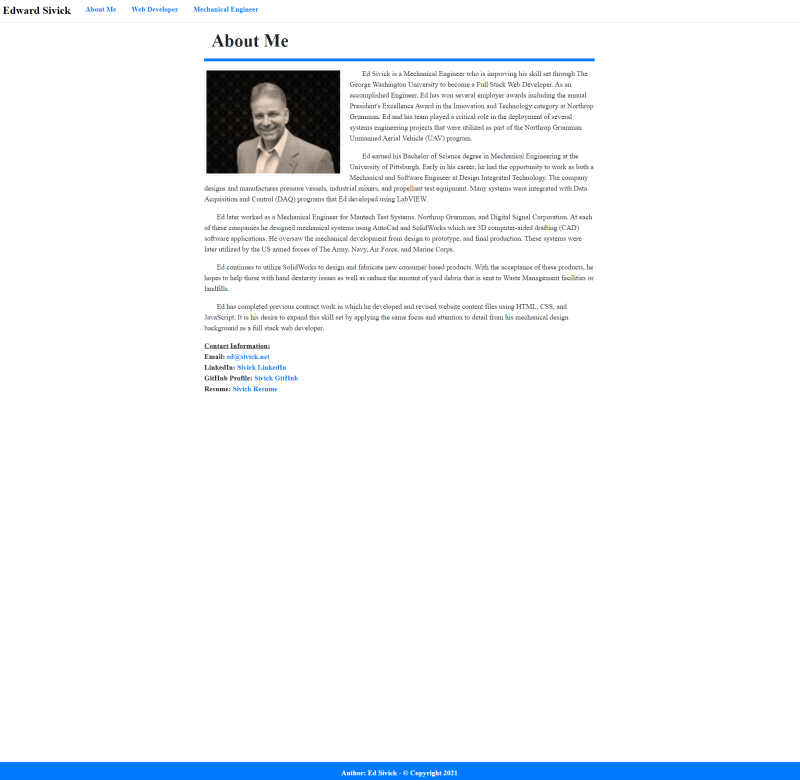
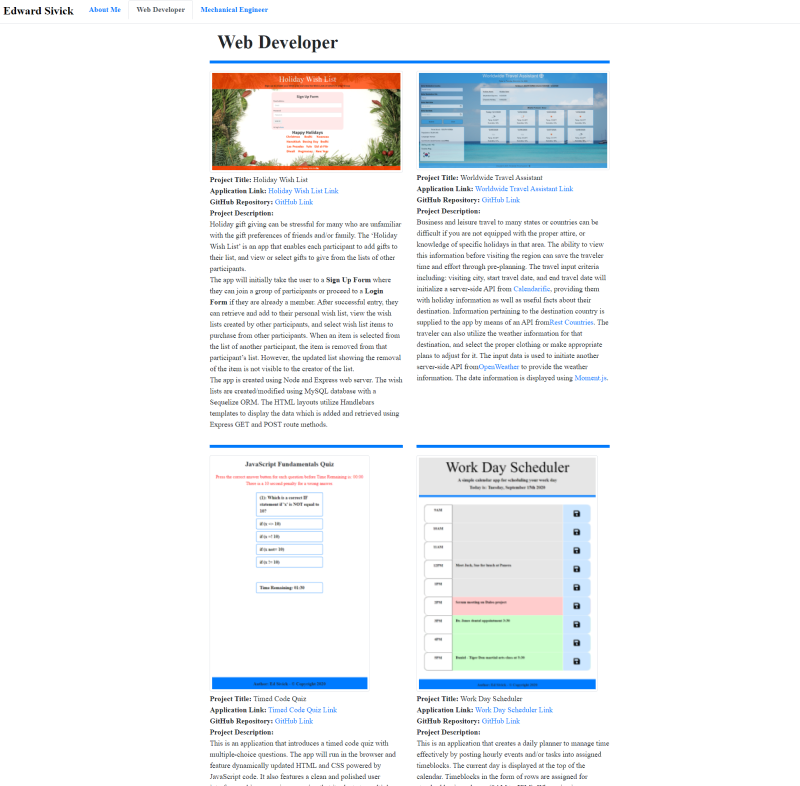
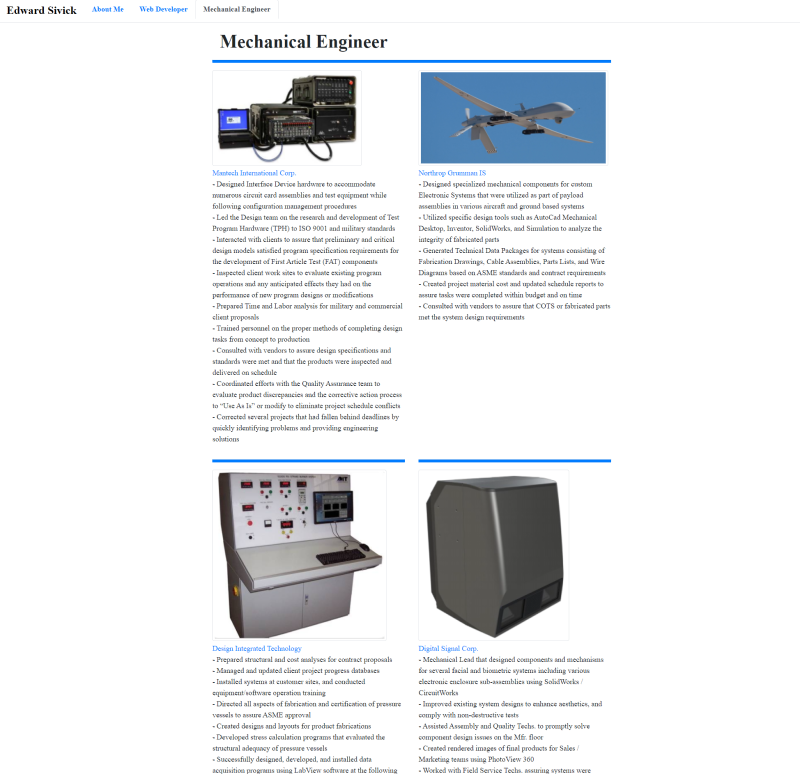

# 20-React Portfolio
____
## Table of Contents
* [Objective](#objective)
* [Installation](#installation)
* [Usage](#usage)
* [License](#license)
* [Contributing](#contributing)
* [Questions](#questions)
* [Application_Links_and_Images](#application_links_and_images)
____
## Objective
Create an updated portfolio using React, featuring 6 total projects.
____
## Installation 
(1) Go to the `src` folder or Explorer area in VS Code, right-click, select **Open in Integrated Terminal** and type: **npm i** (install) to install all required dependencies for the app, creating the **node modules** folder and **package-lock.json** file   
(2) Type **npm start** to invoke the app     
(3) The App will automatically open a webpage on **localhost:3000** displaying the **About Me** page of the portfolio   
(4) The User can then navigate between **About Me**, **Web Developer**, and **Mechanical Engineer** by selecting the associated tab on the navigation bar
_____
## Usage
This app shows my updated portfolio using React.
- The **About Me** page describes a brief summary of my professional career.   
- The **Web Developer** page describes six completed class projects.      
- The **Mechanical Engineer** page describes several tasks / projects that I accomplished at some of the companies where I was employed.
_____
## License
You can view more information concerning software licenses at the following link:

* [License](https://opensource.org/licenses/MIT)
_____
## Badges
 
_____
## Contributing
ed-sivick, W3Schools, Stack Overflow, BCS Unit 20 class documentation
_____
## Questions
If there are any questions, or if you would prefer more information concerning this app,
please contact the following person at their GitHub profile or email address below:

* [GitHub Profile](https://github.com/ed-sivick)
* ed@sivick.net
_____
## Application_Links_and_Images  
**Links:**  
Heroku link: (https://esivick-react-portfolio.herokuapp.com/)

**Application Image Examples:** 

<strong>Image of About Me page</strong>

  
  
 
  

<strong>Image of Web Developer Projects</strong>

  
  
 

  
<strong>Image of Mechanical Engineer Tasks/Projects at Specific Companies</strong>

  
  
 